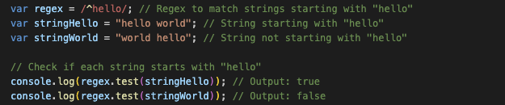
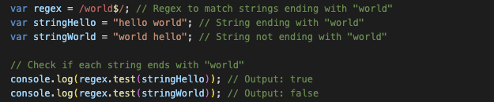
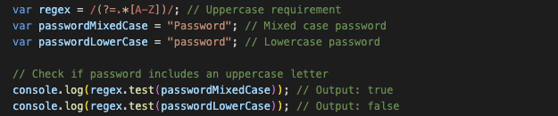
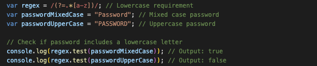
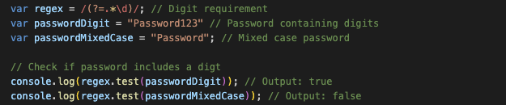
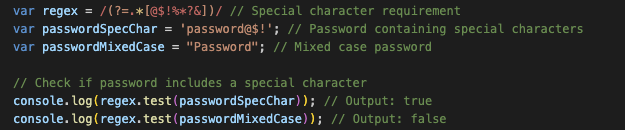
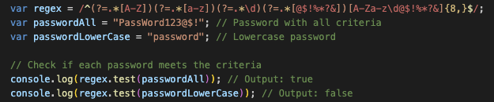
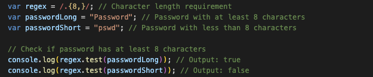

# Mastering Secure Passwords: A Regex Tutorial

In today's digital landscape, where cyber threats are ever-present, ensuring the security of user data is paramount for developers and organizations. One crucial aspect of data security is enforcing robust password policies to safeguard user accounts from unauthorized access. Regular expressions, or regex, serve as powerful tools for validating password strength by defining specific patterns that passwords must adhere to.

In this tutorial, we'll delve into understanding a regular expression used for validating password strength. We'll break down each component of the regex and explain its role in ensuring a strong password. By the end of this walkthrough, you'll have a comprehensive understanding of how this regex works and be equipped to implement similar password validation mechanisms in your own projects, bolstering the security of user accounts against potential threats.

## Summary

The regex we'll be exploring is:
<strong>
```
/^(?=.*[A-Z])(?=.*[a-z])(?=.*\d)(?=.*[@$!%*?&])[A-Za-z\d@$!%*?&]{8,}$/
```
</strong>

This regex focuses on validating strong passwords by enforcing specific criteria: a mix of uppercase letters, lowercase letters, digits, and special characters, with a minimum length of 8 characters. Here's a breakdown of what it does:

- **`(?=.*[A-Z])`**: Ensures there is at least one uppercase letter. 
- **`(?=.*[a-z])`**: Ensures there is at least one lowercase letter.
- **`(?=.*\d)`**: Ensures there is at least one digit.
- **`(?=.*[@$!%*?&])`**: Ensures there is at least one special character.
- **`[A-Za-z\d@$!%*?&]`**: Matches any combination of uppercase letters, lowercase letters, digits, and special characters.
- **`{8,}`**: Ensures the length of the matched string is at least 8 characters.

The tutorial explores the regex components, guiding you through anchors, positive lookaheads, bracket expressions/character classes, and quantifiers.

## Table of Contents

- [Anchors](#anchors)
- [Positive Lookaheads](#positive-lookaheads)
- [Bracket Expressions](#bracket-expressions-character-classes)
- [Quantifiers](#quantifiers)

## Regex Components
A regex is treated as a literal, requiring the pattern to be enclosed within slash characters (/). This becomes evident when examining the regex for "Password Strength Validation."
<strong>
```
/^(?=.*[A-Z])(?=.*[a-z])(?=.*\d)(?=.*[@$!%*?&])[A-Za-z\d@$!%*?&]{8,}$/
```
</strong>

Now, let's analyze the components of this regex.

### Anchors
Anchors are special characters that assert positions in the string. They don't match any actual characters but rather the positions before or after characters. In this regex, two anchors are utilized:

- **`^` (caret)**: This anchor asserts the position at the start of the line. In the context of the regex, **`^`** ensures that the regex engine starts matching from the beginning of the string. It essentially anchors the regex pattern to the start of the input string. For password validation, using **`^`** ensures that the entire password must adhere to the specified pattern right from the beginning.
  > Example: `/^hello/` matches the string `"hello world"` because `"hello"` appears at the start of the string, but it won't match `"world hello"` because `"hello"` does not appear at the beginning of the string.

  > 

- **`$` (dollar sign)**: This anchor asserts the position at the end of the line (or before a line terminator at the end of the string). In the context of the regex, **`$`** ensures that the regex engine matches until the end of the string. It essentially anchors the regex pattern to the end of the input string. For password validation, using **`$`** ensures that the entire password must match the specified pattern until the very end, disallowing any extra characters.
   > Example: `/world$/` matches the string `"hello world"` because `"world"` appears at the end of the string, but it won't match `"world hello"` because `"world"` does not appear at the end of the string.

  > 

Together, the combination of **`^`** and **`$`** ensures that the entire string (in this case, the password) is evaluated against the regex pattern from start to finish. This anchoring mechanism is crucial for enforcing strict password policies, as it prevents partial matches and requires the entire password to meet the specified criteria for validation.

Understanding anchors is fundamental in crafting regex patterns for various purposes, including password validation, data extraction, and text manipulation. They provide precise control over where a match should occur within the input string, contributing to the accuracy and reliability of regex-based solutions.

### Positive Lookaheads
Lookaheads are zero-width assertions in regex that check if a certain pattern is followed by another pattern, without actually consuming any characters in the string. They are useful for enforcing specific conditions without including the matched content in the final match result.

In this regex, positive lookaheads are used to enforce certain character types in the password, ensuring that it meets specific criteria for strength:

- **`(?=.*[A-Z])`**: This positive lookahead asserts that there is at least one uppercase letter (**`[A-Z]`**) present in the password. The **`.*`** preceding the pattern allows any characters (**`.*`** means match zero or more of any character), ensuring that the uppercase letter can appear anywhere in the password.
  > Example: `"Password"` matches because it includes an uppercase letter. However, `"password"` does not match because it lacks an uppercase letter.
  
  > 
  
- **`(?=.*[a-z])`**: Similarly, this positive lookahead asserts that there is at least one lowercase letter (**`[a-z]`**) present in the password. The **`.*`** preceding the pattern allows any characters, ensuring flexibility in the position of the lowercase letter within the password.
  > Example: `"Password"` matches because it contains lowercase letters. However, `"PASSWORD"` does not match because it lacks a lowercase letter.
  
  > 

- **`(?=.*\d)`**: This positive lookahead asserts that there is at least one digit (**`\d`**) present in the password. Again, the **`.*`** preceding the pattern allows any characters, enabling the digit to appear at any position within the password.
  > Example: `"Password123"` matches because it contains a digit. However, `"Password"` does not match because it lacks a digit.
  
  > 

- **`(?=.*[@$!%*?&])`**: Finally, this positive lookahead asserts that there is at least one special character (**`[@$!%*?&]`**) present in the password. The **`.*`** preceding the pattern allows any characters, ensuring flexibility in the position of the special character within the password.
  > Example: `"password@$!"` matches because it contains a special character. However, `"Password"` does not match because it lacks a special character.

  > 

By using positive lookaheads in this manner, the regex ensures that the password contains a diverse set of characters, including uppercase and lowercase letters, digits, and special characters. These assertions contribute to strengthening the password by making it more resistant to brute-force attacks and increasing its complexity.

Understanding lookaheads is crucial for crafting precise regex patterns, especially in scenarios where specific conditions must be met without consuming characters in the input string. They provide a powerful mechanism for enforcing complex validation rules while maintaining flexibility and efficiency in regex-based solutions.

### Bracket Expressions (Character Classes)
Bracket expressions, often referred to as character classes or character sets, allow you to specify a set of characters from which the regex engine can match a single character at a given position in the string. They are enclosed in square brackets **`[ ]`** and provide a concise way to define character alternatives within a single position in the pattern.

In this regex, bracket expressions are utilized to specify the allowed characters for the password:

- **`[A-Za-z\d@$!%*?&]`**: This character class includes a range of characters that the password can contain. Here's a breakdown of the components:
  - **`A-Z`**: Matches any uppercase letter from A to Z.
  - **`a-z`**: Matches any lowercase letter from a to z.
  - **`\d`**: Matches any digit (equivalent to **`[0-9]`**).
  - **`@$!%*?&`**: Matches any of the specified special characters: **`@`**, **`$`**, **`!`**, **`%`**, **`*`**, **`?`**, or **`&`**.
  <br>
  
  > Example: `"PassWord123@$!"` matches the pattern due to its a mix of uppercase letters, lowercase letters, digits, and special characters. However `"password"` does not match as it lacks an uppercase letter, a digit and a special character.

  > 

Bracket expressions (or character classes) offer an efficient means to specify multiple character alternatives within a single position in the regex pattern. They are commonly employed in regex patterns to define character sets, enforce specific input data validation criteria, or match particular character types in the input string.

Understanding bracket expressions is paramount in crafting regex patterns that precisely match desired character sets and enforce specific validation criteria. They provide the necessary flexibility and precision in defining allowed characters within the pattern, thereby enhancing the effectiveness of regex-based solutions across diverse applications.

### Quantifiers
Quantifiers are meta-characters in regex that specify the number of instances of the preceding element allowed in a match. They control the repetition of characters, groups, or character classes in the regex pattern.

In this regex, the quantifier **`{8,}`** is used to specify the minimum number of characters required for the password:

- **`{8,}`**: This quantifier specifies that the preceding element, which in this case is the character class **`[A-Za-z\d@$!%*?&]`**, must occur at least 8 times. The comma **`,`** after the lower bound **`8`** indicates that there is no upper limit to the number of occurrences. Therefore, the password can contain 8 or more characters.

  > Example: `"Password"` matches because it contains at least 8 characters. However `"pswd"` does not match because it does not meet the minimum length requirement of 8 characters.

  > 

By using **`{8,}`**, the regex ensures that the password meets a minimum length requirement of 8 characters. This helps enforce a basic level of security by encouraging users to create passwords of adequate length, which can improve resistance against brute-force attacks.

Quantifiers provide flexibility in defining the repetition requirements for elements in a regex pattern. They can be customized to enforce specific length constraints or allow for variable-length matches, depending on the desired validation criteria.

Understanding quantifiers is essential for crafting regex patterns that accurately validate input data based on repetition rules, such as minimum and maximum length requirements. They play a crucial role in enforcing password policies, data validation rules, and text processing tasks where repetition patterns need to be defined.

## Conclusion
In conclusion, mastering the use of regular expressions (regex) for validating password strength is an essential skill for developers and organizations aiming to enhance data security in today's digital landscape. Through the exploration of a comprehensive regex pattern, this tutorial has provided insights into the fundamental components and techniques involved in crafting robust password validation mechanisms.

The regex pattern dissected in this tutorial focuses on enforcing specific criteria for strong passwords, including a mix of uppercase letters, lowercase letters, digits, and special characters, with a minimum length requirement. By employing anchors, positive lookaheads, bracket expressions/character classes, and quantifiers, the regex ensures that passwords adhere to stringent security standards, thus mitigating the risk of unauthorized access and bolstering the protection of user accounts.

Understanding the intricacies of regex components, such as anchors for precise string positioning, positive lookaheads for conditional matching, bracket expressions/character classes for defining allowed character sets, and quantifiers for specifying repetition requirements, enables developers to implement effective password validation strategies tailored to their application requirements.

As developers continue to navigate the evolving landscape of cybersecurity threats, proficiency in regex for password validation remains a valuable skillset. By leveraging the knowledge gained from this tutorial, developers can contribute to the creation of more secure digital environments, safeguarding user data against potential breaches and ensuring trust in the integrity of online platforms and services.

Incorporating regex-based password validation mechanisms not only enhances data security but also fosters user confidence and trust, ultimately contributing to a safer and more resilient digital ecosystem.

For further exploration and practice, interested readers are encouraged to visit the GitHub repository linked below, where examples are available to deepen their understanding of regex and its applications in cybersecurity and beyond.

## Author
GitHub: 
 - [Profile](https://github.com/kyoriku)
 - [Repository](https://github.com/kyoriku/regex-tutorial)